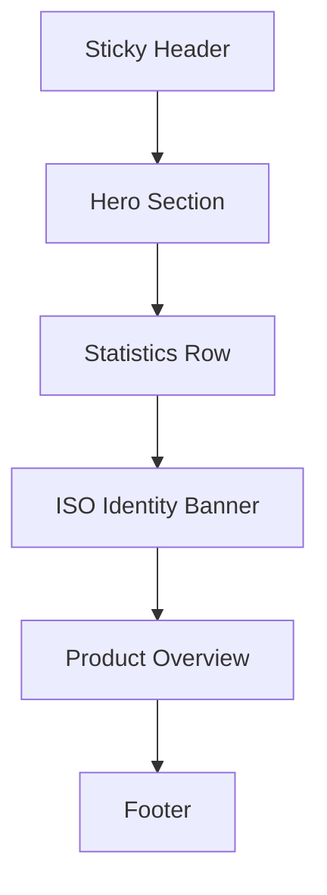

# Machine Tool Landing Page Plan

## 1. Setup & Tooling Commands

| Purpose                                                                                 | Command                                                                                                                 |
| --------------------------------------------------------------------------------------- | ----------------------------------------------------------------------------------------------------------------------- |
| Scaffold Vite + React + TS app                                                          | `npm create vite@latest percitec-site -- --template react-ts`                                                           |
| Enter project & install deps                                                            | `cd percitec-site && npm install`                                                                                       |
| Install Tailwind toolchain                                                              | `cd percitec-site && npm install -D tailwindcss postcss autoprefixer`                                                   |
| Generate Tailwind config                                                                | `cd percitec-site && npx tailwindcss init -p`                                                                           |
| Add base Tailwind layers in [src/index.css](src/index.css)                              | `@tailwind base; @tailwind components; @tailwind utilities;` (manual edit)                                              |
| Configure Tailwind content & shadcn presets in [tailwind.config.ts](tailwind.config.ts) | Extend `content`, `theme`, and include `tailwindcss-animate`                                                            |
| Install UI utilities & icons                                                            | `cd percitec-site && npm install class-variance-authority clsx tailwind-merge lucide-react`                             |
| Initialize Shadcn UI                                                                    | `cd percitec-site && npx shadcn@latest init` _(choose TypeScript, "New York" style, Slate/Zinc palette during prompts)_ |
| Generate required Shadcn components                                                     | `cd percitec-site && npx shadcn@latest add button card navigation-menu`                                                 |

> After setup, run `npm run dev` from `percitec-site` to verify Vite launches with Tailwind styles.

## 2. Directory & Component Plan

| File                                                                                           | Responsibility                                                                   |
| ---------------------------------------------------------------------------------------------- | -------------------------------------------------------------------------------- |
| [src/main.tsx](src/main.tsx)                                                                   | Hydrates `<App />` and imports global styles.                                    |
| [src/App.tsx](src/App.tsx)                                                                     | Wraps the page shell (e.g., `<LandingPage />`) and exports the root layout.      |
| [src/pages/LandingPage.tsx](src/pages/LandingPage.tsx)                                         | Implements the ordered landing sections and composes subcomponents.              |
| [src/components/layout/SiteHeader.tsx](src/components/layout/SiteHeader.tsx)                   | Sticky header using Shadcn `NavigationMenu` with logo placeholder and nav links. |
| [src/components/sections/Hero.tsx](src/components/sections/Hero.tsx)                           | Hero background block with headline, subtext, and `Button` CTA.                  |
| [src/components/sections/StatisticsRow.tsx](src/components/sections/StatisticsRow.tsx)         | White background stat row with four bold metrics.                                |
| [src/components/sections/IsoIdentityBanner.tsx](src/components/sections/IsoIdentityBanner.tsx) | Royal-blue flex banner with Lucide `Settings` and `Wrench` icons plus text.      |
| [src/components/sections/ProductOverview.tsx](src/components/sections/ProductOverview.tsx)     | Grid of Shadcn `Card` components describing product families.                    |
| [src/components/layout/SiteFooter.tsx](src/components/layout/SiteFooter.tsx)                   | Footer with quick links, address, and copyright.                                 |
| [src/components/ui/\*](src/components/ui)                                                      | Generated Shadcn primitives (`button.tsx`, `card.tsx`, `navigation-menu.tsx`).   |

> Components under `sections` can remain purely presentational with props for content should future CMS integration be required.

## 3. Section-by-Section Requirements

### A. Sticky Header

- Positioned with `sticky top-0 z-50 bg-white/90 backdrop-blur`.
- Left: temporary text logo "Percitec Machines" until brand assets arrive.
- Right: lightweight flex nav with anchor tags for `[Home, Company, Products, Software, Services, Contact Us]`; keep the Shadcn `NavigationMenu` component available for future dropdown expansion.
- Typography: uppercase tracking-wide, `text-gray-800`, hover state `text-blue-600`.

### B. Hero Section

- Full-width section with `min-h-[75vh]` and a background image placeholder using `bg-[url('https://images.unsplash.com/photo-1565043589221-1a6fd9ae45c7?q=80&w=1920&auto=format&fit=crop')] bg-cover bg-center` plus `overlay` via pseudo or `after` element until branded photography arrives.
- Content block centered with `max-w-3xl` containing:
  - `h1` ~ `text-5xl md:text-6xl font-bold text-white`.
  - Supporting paragraph `text-lg text-white/80`.
  - Shadcn `Button` labeled "Discover More" linking to product section ID.

### C. Stats & ISO Banner

#### Part 1: Statistics Row

- White background, `py-12`, `grid grid-cols-2 md:grid-cols-4 gap-8 text-center`.
- Each stat: number `text-4xl md:text-5xl font-extrabold text-[#0047AB]`, label `text-sm uppercase tracking-wide text-gray-600`.
- Metrics: `40+ Years of Industry Experience`, `800+ Machines Manufactured`, `6+ Events & Exhibitions`, `2+ Awards & Recognitions`.

#### Part 2: Blue Identity Banner

- `bg-[#0047AB] text-white py-10 px-6 flex flex-col md:flex-row items-center gap-6 md:gap-12`.
- Left icons: stack of Lucide `Settings` (or `Cog`) with `size={48}` and muted opacity.
- Center text block: heading `text-xl md:text-2xl font-semibold uppercase`, subtext italic `text-base leading-relaxed` constrained to `max-w-3xl`.
- Right: Lucide `Wrench` mirrored if desired via `className="rotate-12"`.

### D. Product Overview

- Section wrapper `bg-gray-50 py-16` with container `max-w-6xl`.
- Title `text-3xl font-bold text-gray-900 text-center`.
- Grid `grid gap-6 sm:grid-cols-2 lg:grid-cols-4` of Shadcn `Card` components describing categories (Turning Centers, VMCs, Precision Grinders, Automation Software, etc.).
- Each card uses `CardHeader` for title and `CardContent` for two-line description.

### E. Footer

- Dark slate background `bg-gray-900 text-gray-200`.
- Layout `grid gap-8 sm:grid-cols-2 lg:grid-cols-3` featuring Quick Links list, Corporate Address/contact, and Certification/Tagline block.
- Bottom bar `border-t border-gray-800 pt-4 text-sm` with © text referencing Percitec Machines.

## 4. Layout Flow Diagram

## 5. Implementation Approach & Handoff Notes

1. Complete dependency setup and Tailwind config edits before generating Shadcn components to avoid class-name lint errors.
2. Build semantic sections inside [src/pages/LandingPage.tsx](src/pages/LandingPage.tsx) in the mandated order, using small helper components from `/sections` for clarity.
3. Compose sections inside [src/App.tsx](src/App.tsx) as `return <LandingPage />;` while keeping room for future routing.
4. Keep CTAs anchored via IDs (e.g., `id="products"`) for smooth scrolling from Navigation links.
5. Extend Tailwind's `theme.colors` with a custom `industrialBlue: '#0047AB'` token so utility classes like `bg-industrialBlue` stay consistent across stats and ISO banner.
6. Once the code matches this plan, run `npm run lint` (if configured) and preview via `npm run dev` before handing off assets.
